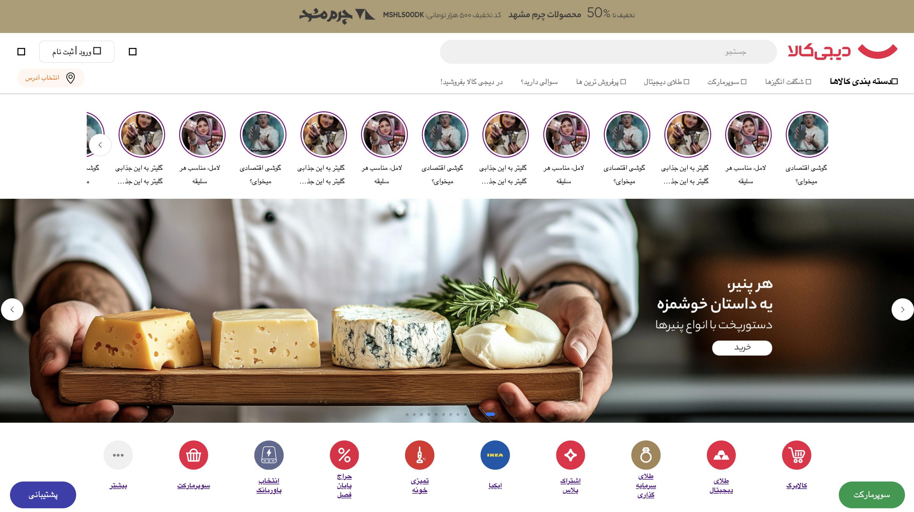

# 🛒 Digikala Website Clone

A front-end clone of the Digikala website built using HTML, CSS, and Swiper.js.

This project was created to practice web layout design, structuring web pages with HTML, styling with CSS, and implementing interactive sections using Swiper.js.

## 🔗 Live Demo

[Digikala Website](https://rosaraad.github.io/Digikala/)

## 📸 Preview

## 🎥 Demo

## ✨ Features

- Desktop-focused website layout
- Product sections inspired by Digikala's design
- Image sliders using Swiper.js
- Custom styling with pure CSS
- Structured page layout using HTML

## 🛠️ Built With

- HTML
- CSS
- Swiper.js
